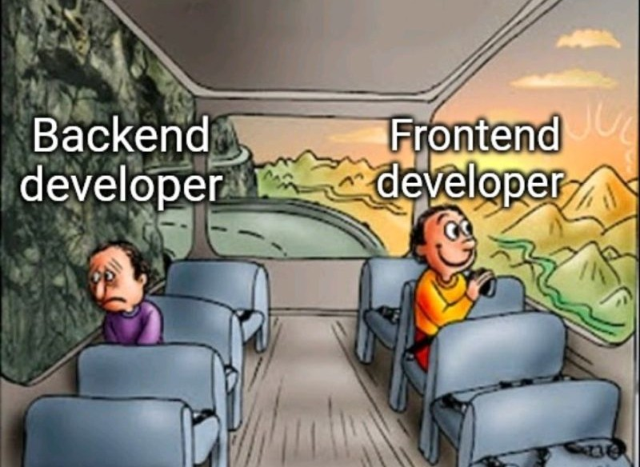
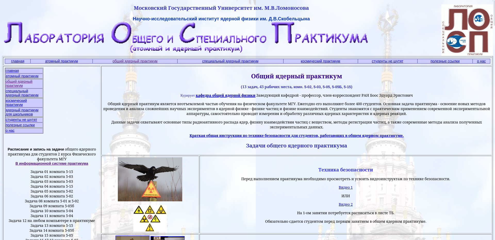

# Добро пожаловать во фронтенд!

Напоминаем:

> Чтобы научиться программировать, нужно программировать.

Поэтому, пожалуйста, смотрите код, задавайте много вопросов и пытайтесь его редактировать!

##  Инструменты разработчика

1. **Среда разработки**.
   В последние годы самым популярным редактором кода стал `Visual Studio Code` (не путать с `Visual Studio`!). Необходимо [установить](https://code.visualstudio.com/download) именно его и некоторое количество полезных плагинов, таких как

    - [Vue Language Features (Volar)](https://marketplace.visualstudio.com/items?itemName=Vue.volar),
    - [TypeScript Vue Plugin (Volar),
      ](https://marketplace.visualstudio.com/items?itemName=Vue.vscode-typescript-vue-plugin),
    - [ESLint](https://marketplace.visualstudio.com/items?itemName=dbaeumer.vscode-eslint),
    - [Prettier - Code formatter](https://marketplace.visualstudio.com/items?itemName=esbenp.prettier-vscode),
    - [Auto Close Tag](https://marketplace.visualstudio.com/items?itemName=formulahendry.auto-close-tag),
    - [Auto Rename Tag](https://marketplace.visualstudio.com/items?itemName=formulahendry.auto-rename-tag),
    - [Auto Import](https://marketplace.visualstudio.com/items?itemName=steoates.autoimport),
    - [CSS Variable Autocomplete](https://marketplace.visualstudio.com/items?itemName=vunguyentuan.vscode-css-variables).

2. **Самое главное** для веб-разработки у вас, безусловно, было установлено всегда и вы этим активно пользуетесь. Конечно, я говорю о браузере. В целом можно использовать любой браузер последней версии, но я советую `Google Chrome`. Нововведения первыми появляются в нем, удобная панель разработчика. Опыт в других браузерах на движке `chromium`, например, в `Яндекс Браузере`, будет аналогичным. Непременно стоит установить расширение [Vue.js devtools](https://chrome.google.com/webstore/detail/vuejs-devtools/ljjemllljcmogpfapbkkighbhhppjdbg) для просмотра дерева компонентов, отслеживания их состояния и общего состояния приложения.

##  Обучающие материалы

В первую очередь необходимо знание "трёх китов" веб-разработки, а именно `HTML`, `CSS` и `JavaScript`. Обучающие материалы о них лезут из каждого угла, но нет ничего лучше, чем:

-   [HTML для Начинающих - Практический Курс](https://www.youtube.com/watch?v=DOEtVdkKwcU),
-   [CSS для Начинающих - Практический Курс](https://www.youtube.com/watch?v=SpCUuyZZTp8),
-   [JavaScript Основы для Начинающих - Полный Курс за 6 часов](https://www.youtube.com/watch?v=Bluxbh9CaQ0).

Если понять `HTML` и `CSS` можно за пару вечеров, то вот изучение JavaScript может затянуться. Поэтому, если вам удобнее текстовый формат, используйте [Современный учебник JavaScript](https://learn.javascript.ru/), который охватывает все вожмости языка, а информация в нем структурирована и хорошо переведена на русский язык не одним годом работы разработчиков.

Затем следует научиться работать с инструментами разработчика в браузере, т. н. DevTools. Можно просто зайти на любую страницу в интернете, нажать <kbd>F12</kbd> и посмотреть, какие возможности они предоставляют. Также можно ознакомиться с обучающим видео [Chrome DevTools — спрятанные полезности](https://www.youtube.com/watch?v=70XMVfGv2Q0).

Проект построен на JavaScript-фреймворке `Vue.js` версии 3 с синтакси                                                                       сом `Composition API` с использованием `TypeScript`. Если какие-то термины для вас оказались непонятными, не отчаивайтесь! В Сети полно замечательного обучающего контента, на котором, в т. ч. учился автор:

-   [Vue 3 Основы для Начинающих - Полный Курс](https://www.youtube.com/watch?v=p059z-0JTFg),
-   [TypeScript - Быстрый Курс за 70 минут](https://www.youtube.com/watch?v=nyIpDs2DJ_c),
-   [TypeScript для продвинутых за 2 часа](https://www.youtube.com/watch?v=7NU6K4170As),
-   [Продвинутые дженерики в TypeScript](https://www.youtube.com/watch?v=YDTZpQrBXjc).

##   «Нулевая» задача

Используя `HTML` и `CSS` cкопируйте и внесите улучшения в сайт [Общего ядерного практикума](http://prac-gw.sinp.msu.ru/nup.php). Свои варианты отправляйте в наш стажерский чат или в [личку куратору](https://t.me/physphile).

##  Дополнительные материалы
- Подкаст [Веб-стандарты](https://web-standards.ru/podcast/),
- [Телеграм-папка](https://t.me/addlist/C59p8vMFR205NTMy) с полезными каналами и чатами по фронтенд-разработке,
- База задач [Leetcode](https://leetcode.com/problemset/all/) для подготовки к IT-собеседованиям,
- Аналогичная система [Codewars](https://www.codewars.com/dashboard), которая предлагает задачи в зависимости от вашего ранга: от элементарных до очень крепких.
